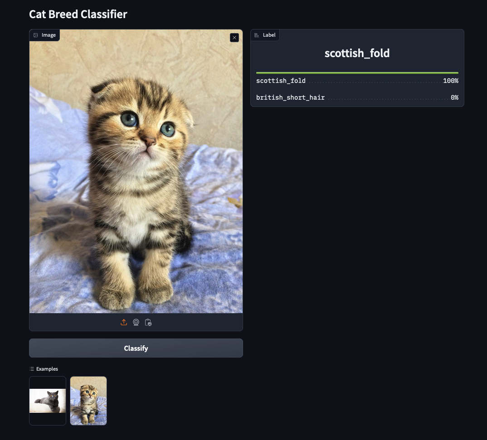

# How to serve a model with fastapi + gradio



/!\ This setup is only suitable for dev/poc purpose


# Installation

> Optinally upload your own model to hugging face hub (`serve.py` assumes it's a fastai model)

### Docker Installation (recommended)
```sh
docker-compose up --build
```

### Dirty Installation (you know how to handle python envs shit)
<details>
<summary>Click if you know what you are doing with python envs shit</summary>

```sh
conda install -c fastai fastai
pip install -r service/requirements.txt
pip install -r app/requirements.txt
```

```sh
cd service
uvicorn serve:app --reload
```

In another terminal
```sh
cd gradio
gradio ui.py
```
</details>

# Run

[http://localhost:7860](http://localhost:7860/)


# How does it work?
1. `ui.py` is a simple gradio app that handles the UI and forward requests to...
2. `serve.py` is a fastapi server that handles incoming requests and pass it to a model for inference

# Caveats:
- The setup is intended for a dev/poc setup
- The model doesn't handle unkown labels
- The model should be on its own server and handle queuing, retry, etc
- Monitoring/Error analysis for data/concept drift is missing
